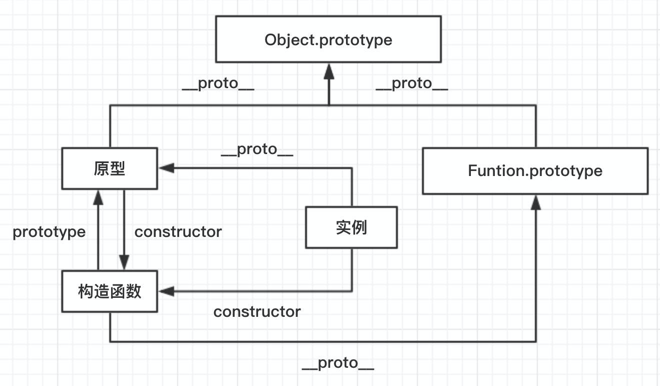
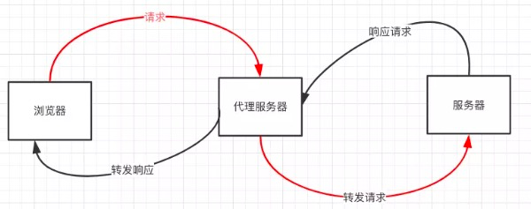

#### 原型 构造函数 实例
+ 原型：一个简单的对象，用于实现对象继承。每个js对象都一个_proto_属性指向原型对象
+ 构造函数： 可以通过new来创建一个对象函数
+ 实例： 通过构造函数和new创建的对象叫做实例。实例有_proto_指向原型，有contractor指向构造函数




#### iframe优缺点
+ 优点: 隔离上下文，便于更改，模块分离。
+ 缺点：影响页面并行加载(主页和iframe共用连接池)

#### 闭包
> 函数对其周围词法环境的引用捆绑到一起构成闭包
+ 闭包可以从内部函数访问外部函数作用域
+ 在javascript中每当有函数创建，就会在函数生成时生成闭包

作用： 创建私有变量防止污染全局变量  
缺点:  造成内存泄漏

#### 跨域
同源策略: 协议、域名、端口都相同
+ jsonp跨域
  + 原理： 利用`<script>`标签支持跨域的漏洞
+ websocket协议跨域
+ nginx代理
  + 原理：类似node中间件
+ 跨域资源共享
+ node中间件
  + 原理： 服务器向服务器传输是无需遵循同源策略的
  + 

有三个标签是支持跨域的
+ ``
+ `<link>`
+ `<script>`

#### call和apply的区别及作用
用来改变this指向，apply可以接收一个数组

#### get和post的区别
get： 使用url传参，长度有限制，传递数据量小，幂等，安全、可缓存
post： 参数存储在实体主题中，长度取决于内存大小和服务器设置，不幂等、不安全、不可缓存

#### js数据类型
Object、Boolean、Symbol、Null、Undefined、Number、Bigint

#### ES6常用10个新特性
1. let和const
2. 箭头函数
3. 模版字符串
4. 函数参数默认值
5. Spread / Rest 操作符 ...
6. 对象和数组解偶
7. 对象超类
8. 类
9. for..of..遍历数组 for..in..遍历对象
10. 二进制和八进制字面量

#### 前端安全
   **xss**
> 跨站脚本攻击

   解决方法: 校验用户输入
    **CSRF**
> 跨站请求伪造

   解决方法: 设置Token

#### BFC
> 一个独立的容器 容器内元素与容器外互不影响

+ `float`不为`none`
+ `overflow`不为`visible`
+ position值为absolute、flex
+ `display`的值为`inline-bloak`、`table-caption`、`table-cell`

#### link和@import的区别
解析到`link`时页面会同步加载`css`，`@import`是页面加载完之后才会加载。
`link`可以动态引入

#### 居中布局
  **水平居中**
+ 行内元素 `text-align: center`
+ 块级元素 `margin: 0 auto`
+ `display: flex; justice-content: center;`
+ `position: absolute;left: 50%;transform: translate(-50%);`

**垂直居中**
+ `line-height: height`
+ `position: absolute;top: 50%;transform: translate(0, -50%);`
+ `display: flex; align-items: center;`

**水平垂直居中**
+ `position: absolute;left: 50%;top: 50%;transform: translate(-50%, -50%);`
+ `display: flex; align-items: center;justice-content: center;`

#### px rem em的区别
`p x` 相对显示器分辨率

`rem` 相对根元素字体大小

`e m` 相对于当前对象字体大小而言的，未设置则相对于浏览器默认字体大小

#### 如何消除img间的间隙
```css
       img {
          outline-width: 0;
          vertical-align: top;
          vertical-align: middle;
          vertical-align: bottom;
          /* 或者 */
          display: block;
       }
   ```
