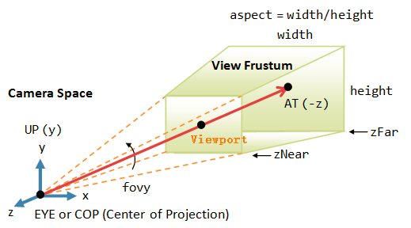

### 场景
> 场景允许你设置哪些对象被`three.js`渲染以及渲染在哪里。我们在场景中放置对象、灯光和相机。
+ 构造器`Scene()`
#### 属性
fog 定义场景中使用雾状类型 默认null  
overrideMaterial 迫使场景中一切对象都使用该材料进行渲染 默认null  
autoUpdate 如果设置为true，那么每一帧渲染都要检查场景和对象是否需要矩阵更新

##
### 相机
1.远景相机(`PerspectiveCamera`)
  + 构造器 `PerspectiveCamera( fov, aspect, near, far )`  
    `fov` 相机视锥体垂直视角  
    `aspect` 相机视锥体宽高比  
    `near`  相机视锥体近裁剪面  
    `far` 相机视锥体远裁剪面
     + 属性：

        `fov`  
             相机视锥体垂直视角，从下到上的观察角度。
        `zoom`  
             相机缩放
     + 方法：

 

##
### WebGL渲染器
> WebGL渲染器使用WebGL来绘制您的场景，如果您的设备支持的话。使用WebGL将能够利用GPU硬件加速从而提高渲染性能。

这个渲染器比 `Canvas`渲染器(`CanvasRenderer`) 有更好的性能。
+ 构造器 `WebGLRenderer( parameters )`
    + 属性：

         `domElement`  
         一个用来绘制输出的 Canvas 对象。该对象通过构造函数中的渲染器所自动创建（如果没有提供的话）；你只需要将其添加到您的网页中。
    + 方法：

         `setSize ( width, height, updateStyle )`  
         调整输出`canvas`尺寸（宽度，高度），要考虑设备像素比，并且设置视口（`viewport`）以匹配该尺寸。如果设置 `updateStyle` 为`true`，则显式添加像素到输出`canvas`的样式中。

##
### 几何模型
1.Geometry
> 这是所有几何模型的基类。

2.盒子模型

+ 构造器 `BoxGeometry(width, height, depth, widthSegments, heightSegments, depthSegments)`
     `width`  X轴上的面的宽度  
        `height`  Y轴上的面的高度  
        `depth`  Z轴上的面的深度  
        `widthSegments`  可选参数. 沿宽度面的分割面数量. 默认值为1  
        `heightSegments`  可选参数. 沿高度面的分割面数量. 默认值为1.  
         `depthSegments`  可选参数. 沿深度面的分割面数量. 默认值为1.
   + 属性：

     `parameters`

3.缓存几何模型
> 该类是一个 几何模型(Geometry) 的高效替代，因为它使用缓存（buffer）来保存所有数据，包括顶点位置、面索引、法向量、颜色、UVs以及自定义属性。
+ 构造器 `BufferGeometry()`
   + 属性：

        `vertices`数组  
        用来保存模型中所有顶点位置的数组。
        要更新该数组，`Geometry.verticesNeedUpdate` 需要被设置为`true`。

##
### 材料
1.基础线条材料
+ 构造器 `LineBasicMaterial( parameters )`  
`color` — 线条的十六进制颜色。缺省值为 0xffffff。  
`linewidth` — 线条的宽度。缺省为 1。  
`linecap` — 定义线条端点的外观。缺省为 'round'（即圆形线头）。  
`linejoin` — 定义线条接口处的外观。缺省为 'round'。  
`vertexColors` — 定义顶点如何着色。缺省是 THREE.NoColors。  
`fog` — 定义材质颜色是否受全局雾设置的影响。默认是false。
   + 属性：

##
### 三维向量
+ 构造器 `Vector3( x, y, z )`

##
### 线条
+ 构造器 `Line( geometry, material )`  
`geometry` — 表示线段的顶点。  
`material` — 线条材料。默认为 LineBasicMaterial.
